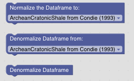
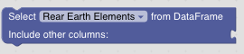

GeoArmadillo Helper Blocks
==========================

*Helper Blocks* perform usefull tasks required for data processing but are not directly part of a specific kind of analysis:

REE Data Normalization and Denormalization
###########################################

In Geochemistry, REE patterns are often normalized against a reference material or system. The *Normalization Blocks* use `pyrolite to normalize data <https://pyrolite.readthedocs.io/en/main/examples/geochem/normalization.html#normalization>`_.

GeoArmadillo has three *Blocks* performing normalization and denormalization:

The original pyrolite implementation select only the REE/REY data from the data frame and removes the remaining elements. In the GeoArmadillo library, we have extended the function so that only the REE/REY data gets normalized or denormalized and the rest of the data frame remains unchanged. In case, you want to select only the REE data, use the *Data Selection Block* below.

GeoArmadillo uses attributes on dataframes to store meta information. Therfore, after the *Normalization Block*, the dataframe "knows" on which dataset it has been normalized. The *Denormalize Block* does not need additional informations to denormalize this data correctly. If there is normalized data and you want to denormalize it explicitly, use the block with the dropdown.

Data Selection
##############

The *Data Selection Block* reduces the data frame exclusively to only REE or REY elements. All other columns like sample type, sample location, etc. are removed. 

..
	Location of a Sample
	####################

	.. image:: images/Add_geolocations.png

	.. image:: images/Filter_to_region.png

Data Clustering
###############

The *Data Clustering Blocks* perform Agglomerative Clustering and allow to plot a Dendogram for the results. `Look it up on scikit learn <https://scikit-learn.org/stable/auto_examples/cluster/plot_agglomerative_dendrogram.html>`_ to learn more on agglomerative clustering.

.. image:: images/cluster_data.png

