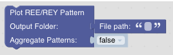

Visualizing Data
================

While there are many different ways to visualize data, we usually only use a limited number of different plots. Currently, GeoArmadillo supports REE/REY pattern plots, but this will be extended soon.

REE/REY Plots
#############

REE/REY Plots with Model
########################

REY pattern smoothness
######################

