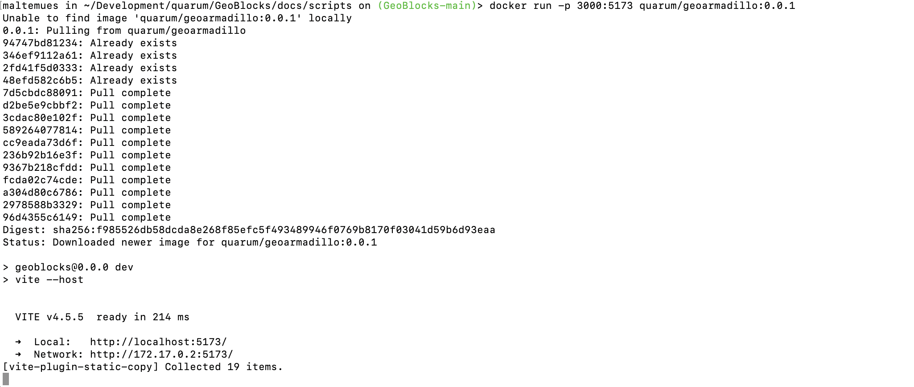
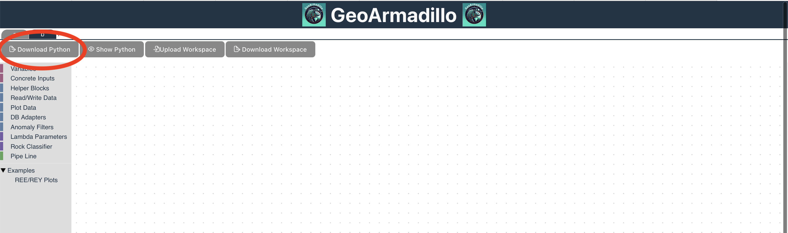
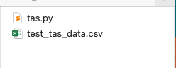

Getting Started
===============

We provide the GeoArmadillo and the pyhton environment to execute generated python code currently in two Docker images at the official `Docker hub <https://hub.docker.com/u/quarum>`_.

The `GeoArmadillo <https://hub.docker.com/r/quarum/GeoArmadillo>`_ images allows to run a container that serves a web server hosting the GeoArmadillo tool and language. The `GeoArmadillo Python <https://hub.docker.com/r/quarum/GeoArmadillo_python>`_ python image allows to run the python script generated inside the container. We will explain here shortly, how to run them.

The GeoArmadillo Container
##########################

The container runs a webserver on port 5137. It is required to command docker to map this port to some port on your local machine in order to get access to it on your host browser.

We start the container from the commandline. Please ensure that Docker Desktop is already running bevor continuing here.

Docker allows to specify a port using the *-p* flag. In the following command, we use the *-p* flag to bin the port 5137 of the container to 3000 on localhost:

.. code:: bash

	docker run -p 3000:5173 quarum/GeoArmadillo:0.0.1

We provided an image for arm64 (Apple Silicon, Snapdragon, etc.) and amd64 (Any modern Intel or AMD CPU). If you have any other CPU please try the *--platform linux/amd64* flag.

If the container started successfully, you should see an output from the commandline similiar to this:

Now, in your favourite Browser open: *localhost:3000*.

You should be greated by the GeoArmadillo tool.

.. image:: images/GeoArmadillo.png
    :alt: GeoArmadillo Tool start page.

The GeoArmadillo Python Container
#################################

Once the *Piepline* is completed, click on the **Download Python** button circled in red.

Copy the script into the same folder as your data and name it to your whish. The documentation will refer to the name of this script  in the docker command with *./your_script_name.py*.

The goal is to mount the current folder in the */experiments* folder in the docker image. Assuming your terminal is currently running in the folder where the data and the script is located,  using the *-v .:/experiments* flag with parameter in the docker run command does this. After successfull execution of the command, your data and scripts are available in the docker container and the python script is executed. As any file writen to the /experiments folder is also persisted to your current directory, the results are available on your host system after execution. The *--rm* flag ensures that the container gets removed after execution. While this is not strictly necessary, it saves ressources on your system. In case of debugging, the container should be run without the *--rm* flag. To run the python script inside the docker container, the full command looks as follows:

.. code:: bash

	 docker run --rm -v .:/experiments quarum/geoarmadillo_python:0.0.1 ./your_script_name.py
