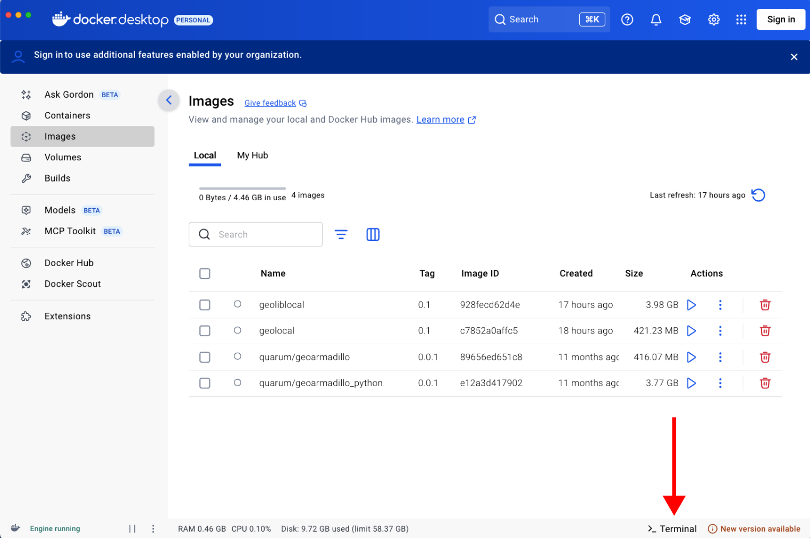
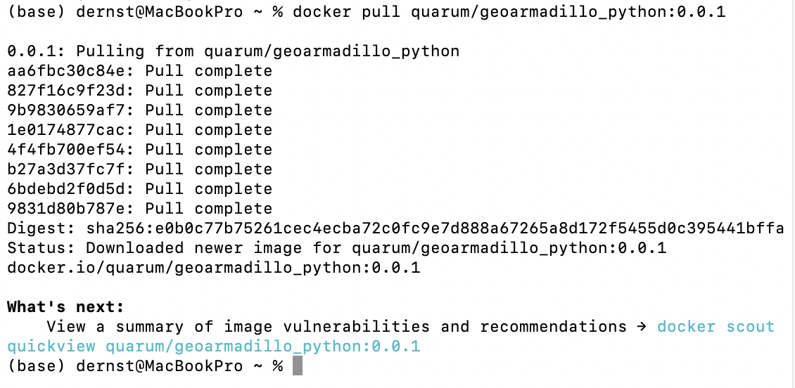
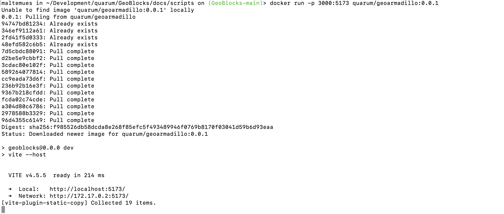
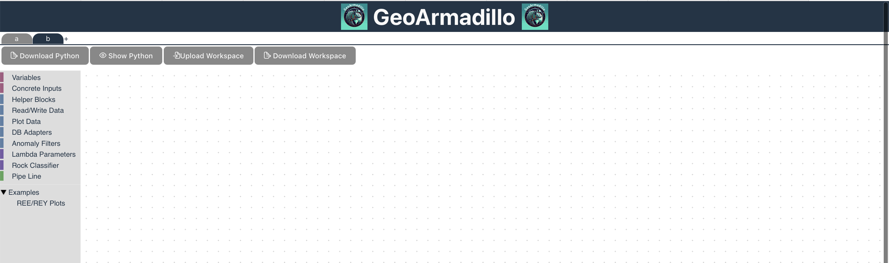
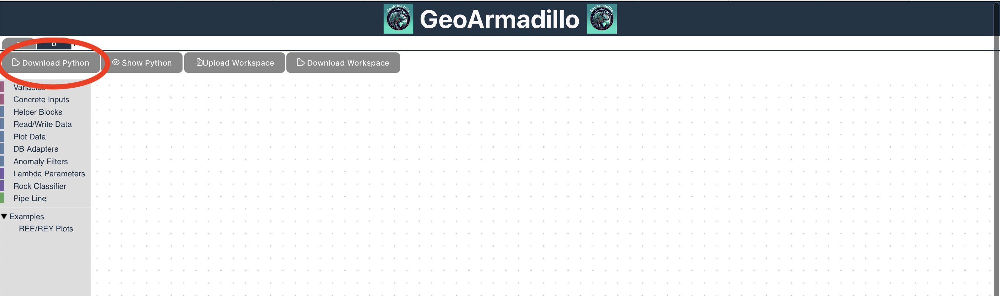

Getting Started
===============

We provide the *GeoArmadillo* and the *Pyhton* environment to execute generated Python code currently in two Docker images at the official |dockerhub_link|.

The |geoarmadillo_docker_link| image allows to run a container that serves a web server hosting the GeoArmadillo tool and language. The |geoarmadillo_py_link| image allows to run the Python script generated inside the container. We will explain here shortly, how to run them.

.. note::
    Docker is a way to pack our software together with everything it needs to run, into something called a “container.” This means it will work the same no matter where you use it on your  computer, a server, or in the cloud.

    Advantage for you: Because we provide our software in a  Docker container, you don’t have to worry about installing extra tools or fixing setup problems. You can start using it right away, without technical hassle.

.. |dockerhub_link| raw:: html

   <a href="https://hub.docker.com/u/quarum" target="_blank">Docker hub</a>

.. |geoarmadillo_docker_link| raw:: html

    <a href="https://hub.docker.com/r/quarum/GeoArmadillo" target="_blank">GeoArmadillo</a>

.. |geoarmadillo_py_link| raw:: html

    <a href="https://hub.docker.com/r/quarum/GeoArmadillo_python" target="_blank">GeoArmadillo
    Python</a>

|

Installing Docker Desktop and Image Download
################################################

You have to **install Docker Desktop**. It can be downloaded for Windows, macOS and Linux free of charge from the Docker webpage at: |docker_webpage_link|

.. |docker_webpage_link| raw:: html

    <a href="https://www.docker.com/" target="_blank">https://www.docker.com/</a>

Afterwards, the two **GeoArmadillo images** have to be **downloaded via** the two **shell commands** given below. A *shell command* can be executed in a *shell* like |launch_powershell| (on Windows) and |launch_macterminal| (macOS and Linux). You can also use the Terminal that is implemented in the Docker Desktop application. You find it at the lower right bottom of the window.

Open your shell, copy & paste the **following command** into the shell and **confirm** by pressing enter.

.. code:: bash

    docker pull quarum/geoarmadillo:0.0.1

This command will download the first image. After the download is completed you can download the second image via:

.. code:: bash

    docker pull quarum/geoarmadillo_python:0.0.1

A successfull image download looks like this:

.. note::
    The *geoarmadillo_python* image is rather large (>2 GB), therefore, the download might take a few minutes. The images only have to be downloaded once. They are stored on your local device. You can find and manage them via the Docker Desktop software.

.. |launch_powershell| raw:: html

 <a href="https://learn.microsoft.com/en-us/powershell/scripting/windows-powershell/starting-windows-powershell?view=powershell-7.5" target="_blank">PowerShell</a>

.. |launch_macterminal| raw:: html

    <a href="https://support.apple.com/guide/terminal/open-or-quit-terminal-apd5265185d-f365-44cb-8b09-71a064a42125/mac" target="_blank">Terminal</a>

|

The GeoArmadillo Container
##########################

To start the container that runs GeoArmadillo, you **first** have to **launch Docker Desktop**, unless it is already running. After Docker Desktop launched, it can be minimised and will run in the background.

**Afterwards**, you have to **run** the **GeoArmadillo image** via the command below. Open your local shell, copy & paste the command and confirm by pressing enter.

.. code:: bash

	docker run -p 3000:5173 quarum/geoarmadillo:0.0.1

If the **container started** successfully, you should see an **output** in your shell similiar to the screenshot below. While working with GeoArmadillo, **do not close the shell**, but you can minimise it. Once you are done with your work, you can close the shell.

Now, **open** your favourite **browser** (Firefox, Chrome, Edge...) and **navigate** to **localhost:3000** in the address line.

.. code:: bash

    http://localhost:3000

The GeoArmadillo tool should open up and you can start building your data processing pipeline as described in :ref:`GeoArmadillo-Pipeline`.

.. note::
    The container runs a webserver on port *5137* and it has to be mapped to a different port on your local machine to get access via your host browser. Docker allows to specify a port using the *-p* flag. In the command above, we use the *-p* flag to bin the port *5137* of the container to *3000* on localhost.

.. warning::

    We provided an image for arm64 (Apple Silicon, Snapdragon, etc.) and amd64 (Any modern Intel or AMD CPU). If you have any other CPU please try the *--platform linux/amd64* flag.

    .. code:: bash

        docker run -p 3000:5173  -platform linux/amd64 quarum/geoarmadillo:0.0.1

|

The GeoArmadillo Python Container
#################################

Once your pipeline is completed, click on the **Download Python** button in the upper left corner. This will translate your GeoArmadillo data processing pipeline into an executable Python script.

A **download window** opens and you are asked to give the **location and name** where the **generated Python script** should be **saved**. To run the Python computation in the GeoArmadillo Python Container, the **downloaded Python script** and the **input data** should be stored in the **same location**. Give the script a meaningful name so that you remember what it does.

.. warning::
    Define **relative paths** for input and output files in your **data processing pipeline**. **Make sure** that the generated **Python script** is **stored accordingly**.

    .. image:: images/rel_path_input_output_script.png
        :alt: python script and data in the same folder

Afterwards, the **generated and downloaded Python script** should be **executed**. This is done within the GeoArmadillo Python Container. Open a **new window or tab** in your **shell**. Then, **navigate** to the **folder** in which the Python **script and input data** are **stored** (as described above). To **navigate** through folders within the shell you can **use** the **cd command**.

    | Navigating in *PowerShell*: |navigate_powershell_link|
    | Navigating in *Terminal*: |navigate_terminal_link|

The Python script is **executed** by the **command** below. Again, copy & paste the command to your shell and confirm by pressing enter. **Replace** "*your_script_name.py*" by the **name of your Python script**.

.. code:: bash

	 docker run --rm -v .:/experiments quarum/geoarmadillo_python:0.0.1 ./your_script_name.py

Once the computations are done, you will **receive your output** in the defined output folder(s).

.. note::
    The goal is to mount the current folder in the */experiments* folder in the docker image. This is achieved via the *-v .:/experiments* flag in the command above.

    After successfull execution of the command, your data and scripts are available in the docker container and the Python script is executed. As any file writen to the */experiments* folder is also persisted to your current directory, the results are available on your host system after execution. The *--rm* flag ensures that the container gets removed after execution. While this is not strictly necessary, it saves ressources on your system. In case of debugging, the container should be run without the *--rm* flag.

.. |navigate_powershell_link| raw:: html

    <a href="https://learn.microsoft.com/en-us/powershell/scripting/samples/managing-current-location?view=powershell-7.5" target="_blank">Managing current location</a>

.. |navigate_terminal_link| raw:: html

    <a href="https://help.ubuntu.com/community/UsingTheTerminal" target="_blank">File & Directory Commands</a>