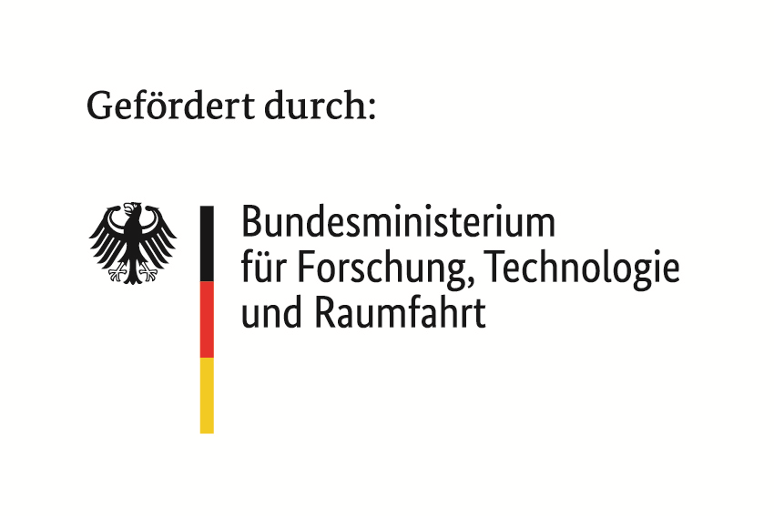

Impressum
=========
| Malte Mues
| Otto-Hahn-Str. 12
| 44227 Dortmund
| Germany
| quarum@geoscience.tools

Haftungshinweis:
Trotz sorgfältiger inhaltlicher Kontrolle übernehmen wir keine Haftung für die Inhalte externer Links. Für den Inhalt der verlinkten Seiten sind ausschließlich deren Betreiber verantwortlich.

The QuARUm project is conducted in collaboration with Constructor University and is funded by the Federal Ministry of Research, Technology, and Space (BMFTR) and the Europian Union, grants 16DKWN124A and 16DKWN124B.

