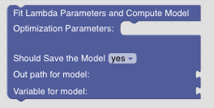
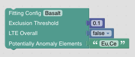
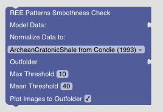
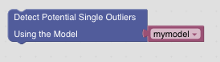
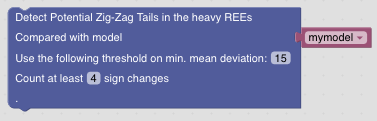
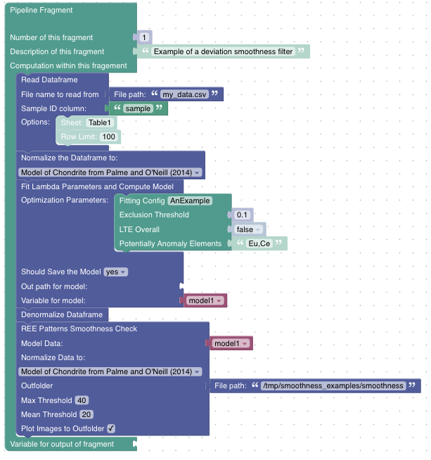

Data Regression Models
======================

Lambda Parameter Modelling
##########################

Computing a model
-----------------

GeoArmadillo offers a comfortable way to fit regression models using the approach suggested by `O'Neil <https://academic.oup.com/petrology/article/57/8/1463/2413419>`_ for describing pattern smoothness. There is a list of longer research activities leading to an `implementation of this approach in pyrolite. <https://pyrolite.readthedocs.io/en/develop/examples/geochem/lambdas.html>`_

GeoArmadillo uses this implementation inside the *Fit Lambda Parameters and Compute Model Block* to compute a regression model for the REE pattern. The *Block* expects a normalized dataframe and allows to store the model either to a variable or write it to disk. See the :ref:`example below <lambda_example>` for an example how the model is stored in a variable.

This *Block* above requires *Optimization Parameters* that are passed by the following *Block*:

The algorithm tries to automatically exclude outlier elements from the fitting. For example, Ce and Eu anomalies are rather frequent in geochemical samples and thus would be excluded in the fitting. The *Exclusion Threshold* defines how much deviation between the model and an element is allowed to be **not** considered an outlier. The feature for fitting the Lanthanide Tetrad Effect (LTE) is currently in development. Leave *LTE Overall* to *false*.

Smoothness Check with Model
---------------------------
Once a model has been compute, it is possible to evaluate the smoothness of the REE pattern by computing the deviation between measured and modeled values. The *REE Patterns Smoothness Check Block* expects the data to be unnormalized and requires a model as input. The *Block* saves the performed checks into the outputfolder. *Max Threshold* sets the maximal deviation allowed for a single element before the sample is flagged. *Mean Threshold* sets the average deviation accros all REE allowed before the sample flagged. If *Plot Images to Outfolder* is ticked, REE plots of the flagged samples are saved to the output folder.

Outlier Detection
------------------

GeoArmadillo tries to specify unsmooth samples further. This blocks adds a flag that marks samples with a potential single outlier in the pattern. It requires
a model as input.

Potential Limit of Detection Annotation
---------------------------------------

GeoArmadillo tries to specify samples with non-smooth REE pattern further. The *Detect Potential Zig-Zag Tails in heavy REEs Block* flaggs samples with a potential zig zag tail in the heavy REE pattern. It might be an indication for a sample measured to close to the limit of quantification.

.. _lambda_example:

Putting it together: An Example
------------------------------------

Here is an example pipeline how model generation and the smoothnes check might be combined.

