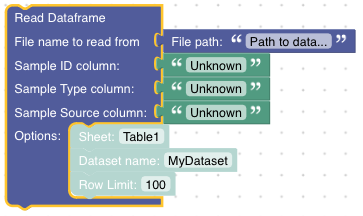

Read and Write Dataframes
#########################

GeoArmadillo can store data in the memory using *variables* or on disk using *files*.

The respective *Blocks* are found in the *Read/Write Data* section of the toolbox.

.. image:: images/read_write_section.png
    :alt: Read/write section in the toolbox

Dataframe Reader
================

Pandas offers :func:`pandas.read_csv` or :func:`pandas.read_excel` for reading dataframes from comma seperated value files (ending usually in .csv or .txt) or Excel files (ending in .xls or .xlsx). For GeoArmadillo, csv and excel files are booth good engough and we do not make this separation. Read Dataframe tries to open the file given as path argument. Depending on the `.csv` or `.xlsx` ending, it chooses a pandas method to read the content.
However, it is possible to configure some options intended to be used in combination exclusively with Excel files. For example, the *sheet option* has no meaning in combination with a *.csv* file but might be used to select a sheet from an Excel file.

The *Read Dataframe Block* currently exists in two versions:

Version A:

.. image:: images/read_dataframe_short.png
    :alt: Read Dataframe Block with simple options

Version B:

Both require the *file path* and the name of the column that identifies the samples. This is the value given to the *Sample ID column* input. The optional *Dataset name* allows to give the dataset a specific name. *Row Limit* allows to run the analysis only for the first N samples from the file (consider this especially for debugging).

Version B allows to additionally specify the name of the column containing the *Sample Type* (rock type, water, etc.) and the *Sample Source* (the link to the original publication). If specified, these information will be reused in plots as meta information.

Dataframe Writer
================

The dataframe writer saves the current dataframe used in the pipeline on the local disk. The file name decides, whether the :func:`csv <pandas.to_csv>` or :func:`excel <pandas.to_excel>` writer of pandas is used. You should find the resulting file at the location specificed in the path argument. Relative paths are executed relative to the current working directory during script execution.

.. note:: Current working directory

    The current working directory can be obtained by running `import os; os.getcwd()` inside the python interpreter. Usually, this is the directory in which the python interpreter has been invoked.

.. image:: images/write_dataframe.png
    :alt: Write a dataframe to file

Read Dataframe from Variable
=============================

It is possible to store dataframes as variables to reuse them later in the script. Here is the *Read Dataframe From Variable Block*:

.. image:: images/read_df_variable.png
    :alt: read dataframe from variable block

.. tip::
    Starting a new *Pipeline Fragement* that processes the dataframe previously stored in the variable *my model* looks like this:
    
    .. image:: images/read_dataframe_variable_example.png

Write Dataframe to Variable
=============================
This *Block* saves a dataframe to a variable.

.. image:: images/write_df_variable.png
    :alt: write dataframe to variable block

